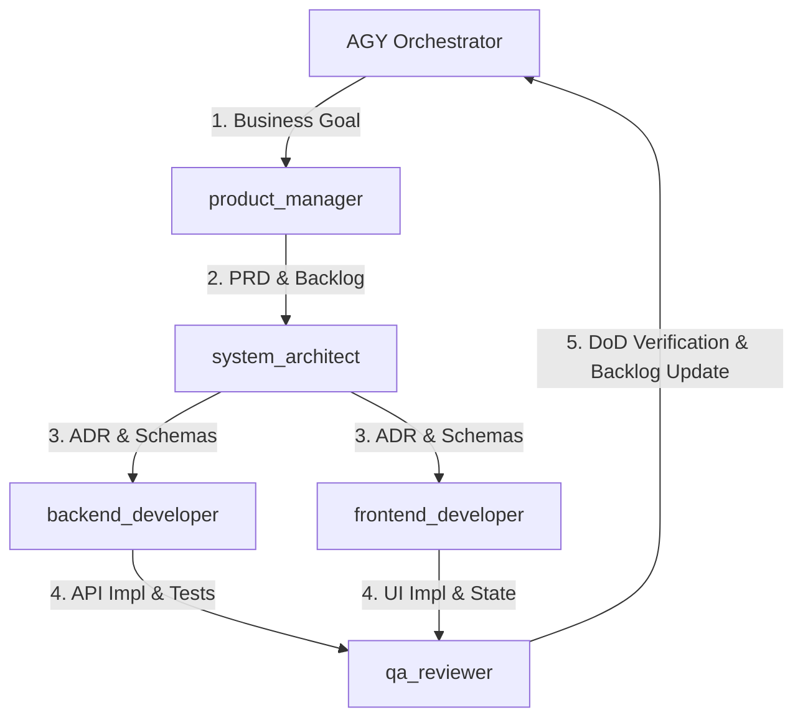

# AGY Orchestrator Sub-Agent Dispatch & Management Protocol

## Overview
As AGY (the Orchestrator Agent), you are responsible for orchestrating the specialized sub-agents (`product_manager`, `system_architect`, `backend_developer`, `frontend_developer`, `qa_reviewer`).

---

## 1. Dispatch Lifecycle

---

## 2. Sub-Agent Dispatch Routine

When dispatching any Sub-Agent:
1. **Load YAML Contract**:
   Target the agent contract in `agents/<role>.md`. Ensure the input dependencies specified in the contract exist before dispatching.
2. **Attach Execution Prompt**:
   Inject the corresponding execution prompt artifact from `agents/prompts/<role>_agent.md`.
3. **Enforce Boundary Isolation**:
   Do not allow sub-agents to perform edits outside their designated write paths.
4. **Process Completion Report**:
   Parse the structured YAML/JSON completion report returned by the sub-agent. Validate that all quality gates report `PASSED: true`.

---

## 3. Sub-Agent Directory Map

| Agent Key | Contract File | Prompt Artifact | Allowed Write Boundary | Primary Output |
| :--- | :--- | :--- | :--- | :--- |
| `product_manager` | [agents/product.md](file:///Users/hossein/Projects/taskflow-gemini/agents/product.md) | [agents/prompts/product_agent.md](file:///Users/hossein/Projects/taskflow-gemini/agents/prompts/product_agent.md) | `docs/prd/`, `docs/sprint/` | PRDs & Backlog |
| `system_architect` | [agents/architect.md](file:///Users/hossein/Projects/taskflow-gemini/agents/architect.md) | [agents/prompts/architect_agent.md](file:///Users/hossein/Projects/taskflow-gemini/agents/prompts/architect_agent.md) | `docs/adr/`, `shared/schemas/` | ADRs & Zod Schemas |
| `backend_developer` | [agents/backend.md](file:///Users/hossein/Projects/taskflow-gemini/agents/backend.md) | [agents/prompts/backend_agent.md](file:///Users/hossein/Projects/taskflow-gemini/agents/prompts/backend_agent.md) | `apps/api/src/`, `apps/api/prisma/` | Fastify Routes & Unit Tests |
| `frontend_developer` | [agents/frontend.md](file:///Users/hossein/Projects/taskflow-gemini/agents/frontend.md) | [agents/prompts/frontend_agent.md](file:///Users/hossein/Projects/taskflow-gemini/agents/prompts/frontend_agent.md) | `apps/web/src/` | React Components & State |
| `qa_reviewer` | [agents/qa.md](file:///Users/hossein/Projects/taskflow-gemini/agents/qa.md) | [agents/prompts/qa_agent.md](file:///Users/hossein/Projects/taskflow-gemini/agents/prompts/qa_agent.md) | `docs/sprint/backlog.md`, `docs/reports/` | Test Verification & DoD |
